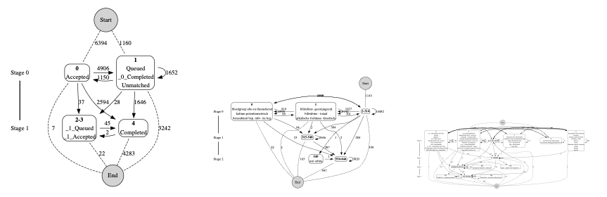
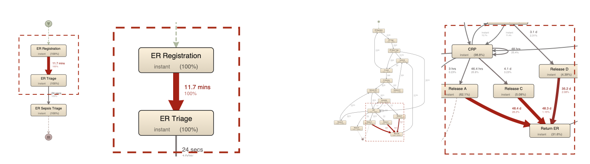

# VARIANT_EXTRACTION
This repository comprises packages for extracting and visualizing process variants and models for complex event data. It contains the following:
- (A) `varexpm/cm_methods`: A visualization package for deriving and evaluating **concise models** from large, unstructured data (Associated with a submission for CAiSE 2026), and
- (B) `ve_methods`, `ve_main`: A CLI-Tool for extracting **context-based process variants** (Associated with the article Rubensson et al., 2024).

See information for each package below.

---
## (A) Concise Models Visualization and Evaluation Package 

*Figure: Three examples of concise models.*

### Setup
1. Download and place the "VARIANT_EXTRACTION" folder somewhere on your computer
2. Create a new virtual environment with `python -m venv [namevenv]` (Recommended)
3. Activate the new virtual environment with (on MacOS) `source [namevenv]/bin/activate` (on Windows) `.\[namevenv]\Scripts\activate` (Recommended)
4. Install the package by going to the root folder in your terminal and:
  - (option a - *recommended*) execute: `pip install -e .` (with notebook dependencies: (MacOS) `pip install -e ".[notebooks]"`/(Windows) `pip install -e .[notebooks]`), or
  - (option b) execute: `pip install -r requirements/requirements_base.txt` (only installs the necessary requirements.)

> Note 2025-11-29: In short time (a couple of days), you will be able to download the package using `pip varexpm`.

### How to use the package
Use the package with `import varexpm` in a notebook or Python-script.

The tutorial notebook under `notebooks/notebook_concisemodels_tutorial.ipynb` is the best way to get to know the most important functions for log preparation, model discovery, and evaluation.
> Note: If you use a jupyter notebook, make sure the kernel uses the packages. Best way to ensure this is to 
 - (1) have  `ipykernel` installed (also available as optional dependencies, see above). 
 - Then, (2) create `python3 -m ipykernel install --user --name=[namevenv]` add your environment with the packages. 
 - Finally, (3) open jupyter with `jupyter lab` in the terminal, go to the notebook, and add the environment as a kernel in the upper-right corner of the notebook.

We also list some of the most important functions below.
#### Log import:
- Import: `from varexpm.utils.data_importing import load_event_log`
- `log = load_event_log("runningexample.xes", "input")`

*This function is based on `pm4py`, hence, you can also use pm4py directly. For the subsequent functions to work, you need to have imported an event log as a pandas dataframe.*

#### Log enhancement:
- Import: `from varexpm.cm_methods.cm_orchestrator import enhance_log_for_concise_model`
- Define dependency threshold: `dependency_threshold=0.5`
- Define number of stages: `num_stages = 2`
- Define number of representative communities `num_comm_ranks=0` (0 returns all, 1 returns 2 nodes)
- Define number of representative activites `num_act_ranks=0` (0 returns all, 1 returns 1)
- Decide if you also want to hide the most common activities `hide_common_activities=False`
- Enhance log: `log_comm = enhance_log_for_concise_model(log, num_stages = num_stages, dependency_threshold=dependency_threshold, num_comm_ranks=num_comm_ranks, num_act_ranks=num_act_ranks, hide_common_activities=hide_common_activities)`

#### Model discovery:
- Import: `from varexpm.cm_methods.cm_orchestrator import discover_concise_model`
- Discover model: `dfg_comm, s_comm, e_comm,stage_comm_dict, comm_acts_dict = discover_concise_model(log_comm)`

#### Model visualization:
- Import: `from varexpm.cm_methods.visualization.concisemodelbuilder import build_concise_dfg`
- Choose to hide non-representative activites in the graph `hide_hidden_activities = False`
- Visualize model: `dot_res = build_concise_dfg(dfg_comm, s_comm, e_comm, comm_acts_dict, stage_comm_dict,hide_hidden_activities=hide_hidden_activities)`
- Render: `dot_res`

#### Model evaluation:
- Import: `from varexpm.cm_methods.evaluation.evaluation import generate_evaluation_statistics_df`
- Generate evaluation statistics: `eva = generate_evaluation_statistics_df(log_comm, dfg_comm,COMM_RANK_OVERALL_COL='community_rank_overall',log_name = log_name, log_name_col="log_name")`

---
## (B) Context-Based Variant Extraction CLI Tool

*Figure: Example variant graphs from Rubensson et al. (Fig. 1, 2024).*

### Setup
1. Install the necessary packages (see the requirements below)
2. Download and place the "VARIANT_EXTRACTION" folder somewhere on your computer
3. Add an event log (.xes) in the folder `"/data/input"` (e.g., the sepsis log: https://data.4tu.nl/articles/_/12707639/1) 

**REQUIREMENTS (incl. recommended versions)**
* Anaconda (2023.09): https://anaconda.org 
* Python (3.11.6): https://www.python.org
* PM4PY (2.7.8): https://pm4py.fit.fraunhofer.de
* Jupyter lab (3.6.3): https://jupyter.org
* Pandas (2.1.1): https://pandas.pydata.org
* NumPy (1.24.3): https://numpy.org
* Scikit-Learn (1.3.0): https://scikit-learn.org

---
### HOW TO USE APPLICATION: 
### Execute Program
1. Open the terminal on your computer (e.g., "Terminal" on MacOS)
2. In the terminal: Navigate to the folder "VARIANT_EXTRACTION" via the terminal (`$cd ./VARIANT_EXTRACTION`)
3. Execute the program:
  a. in the command-line tool: (`$ python ve_main.py`), or
  b. in a Jupyter notebook: Open the Jupyter notebook "ve_jupyter.ipynb" with (`$ jupyterlab`).
4. After execution, you can retrieve the extended log and its calculations in the folder `"/data/output"`. 

### Usage
The program will guide you through five stages:
1. IMPORT: You are prompted to select a log and confirm the standard event/case attributes (case, activity, and timestamp).
2. PROPERTY DEFINITION: You are able to define properties to calculate variants.
3. INSTANCE DEFINITION: The program creates a new instance log (automatically).
4. BINARY MAPPING & VARIANT CLASSIFICATION: The program utilizes a one-hot encoder to transform the log based on the properties and calculate the variants.
5. EXTEND & EXPORT LOGS: The calculated variants are integrated into the original log as a new column with variant numbers and exported as both a .xes as well as a .csv file together with a .csv file containing the calculations and the properties as a .txt file.

The exported log can be used for further calculations in another program (.xes and .csv). The calculation .csv file can be used to gain more insights about the calculations. The properties are exported as a .txt file.

#### Property Definition (Pre-Processing Functions)
Whenever the program prompts you to define properties, you are able to define various properties depending on the type of attribute (case/event) or type of data (categorical/numerical). 
Based on these properties, the program first creates a new log, a so-called instance log, in which each row refers to a case, and every column is the summarized value based on the properties defined. 
The instance log is later used by the program to create the variants.

**The functions implemented for each attribute and data type are as follows:**

##### A. Attribute type
**Case attributes:** Represent one value per case. These values are used in the instance log. Ignores empty cells.

**Event attributes:** Must first be summarized into a value that represents the complete instance:
- _categorical data:_ combines the numbers into a string (e.g., "A, B" => "AB").
- _numerical data (sum):_ calculates the sum (e.g., "1, 2, 3" => "6").
- _numerical data (median):_ calculates the median (e.g., "1, 2, 3" => 2).
- _numerical data (mean):_ calculates the mean (e.g., "1, 2, 3" => 2).

##### B. Data type

**Categorical data** (e.g., A, B):
- _categorical:_ partitions the log based on different nominal categories (e.g., A, B => two possible partitions).

**Numerical data** (e.g., 1, 2):
- _categorical:_ partitions the log based on different nominal categories (e.g., 1, 2 => two possible partitions).
- _threshold:_ partitions the log based on a threshold (e.g., "100" => two possible partitions, partition 1 < 100 ≤ partition 2).

The properties are limited to the functions above. However, there is a possibility of extending the program with further functions. This can be done in `"ve_methods/ve_propertydefinition.py"`. 
  
---
### TROUBLESHOOTING
**(1) Import problem/Directory problem:**
The program was only tested on MacOS. On other OS, the program might have trouble finding the folders in the directories of your computer. 
Please consider adapting the import and export functions in "/ve_methods/ve_logprocessing.py."

**(2) Log transformation problem/Property definition problem:**
The program might not be able to map all data types properly. The reason for this might be two-fold:
1. First, the program is limited to case and event attributes, which are either categorical (str, int, float) or numerical (int, float). Attributes containing any other data types, such as DateTime, Objects, or similar, may cause problems.
2. Second, the program may not handle logs with attributes of mixed data types (e.g., str + int), or case attributes with no value (all cells for a case are empty). 
   
In these cases, please consider pre-processing the log, e.g., using Disco, PM4Py, or ProM.
---
## Licences and dependencies

This project is distributed under the AGPLv3. It makes use of third-party Python and JavaScript packages, whose licenses are provided in the `LICENCES_thirdparty/` directory.

## References related to this package:
Rubensson, C., Mendling, J., Weidlich, M. (2024). Variants of Variants: Context-Based Variant Analysis for Process Mining. In: Guizzardi, G., Santoro, F., Mouratidis, H., Soffer, P. (eds) Advanced Information Systems Engineering. CAiSE 2024. Lecture Notes in Computer Science, vol 14663. Springer, Cham. https://doi.org/10.1007/978-3-031-61057-8_23

Furthermore, in the `data/input`, we have an event log stemming from https://processmining.org/old-version/event-book.html. 

### Contact:
Feel free to contact me for any problems with the program. You find my contact details on https://hu-berlin.de/rubensson.
